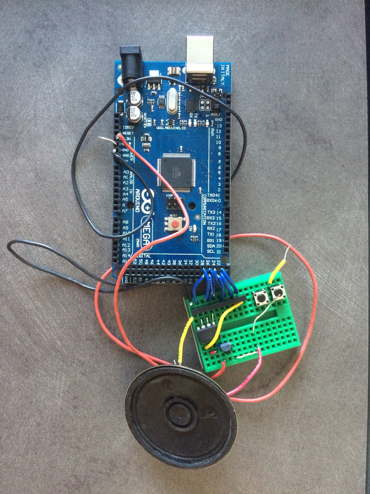

# Arduino 8 bit Digital Audio Synthesizer
## What We Did:
As a first project for a class called Software Systems at Olin College, we made an 8-bit Arduino audio synthesizer. This project gave us the opportunity to really use C for the first time in a project setting, as well as explore the nuances of embedded systems. Our initial plan for the project was to develop a miniature MIDI interfaced digital audio synthesizer, but as the project progressed we decided to shift gears and instead focus on sinewave synthesis. We had hoped to be able to implement polyphony and an interesting form of user interface, but this is still something to be developed. As of right now, we can currently produce a sine wave of a specific frequency. While we have not reached our end goal yet, we have learned a lot from the experience, both technical experience with C as well as experience with project scoping and adaption.


## Background and Resources:
Digital audio synthesis is essentially taking digital signals or data and converting it into sound waves.  Digital audio synthesizers are all over the place, from inside your computer (a computer sound card is not unlike a digital audio synthesizer) to the classic examples of MIDI players and other electronic instruments. Digital audio synthesis is interesting because it allows us to process audio in the digital domain.

## Implementation
Our hardware consists of an Arduino Mega (a microcontroller board based on the ATmega2560 chip), an 8-bit R-2R ladder network, an op-amp, a transistor, and a speaker. More detailed instructions on the components and how to assemble the hardware can be found [here](http://thinkdsp.blogspot.com/2014/02/build-softsyssynth.html)
Essentially, the R-2R network acts as a simple digital to analog converter (DAC), the operational amplifier serves as a buffer, and the transistor amplifies the resulting analog signal to a level sufficient to drive the speaker.

Our software implementaion works by first generating a 256 element long array that contains a single sine wave period with values between 0 and 255 inclusive. Initially we had a separate function that generated this table, but during the process of debugging we removed the function and replaced it with a specific definition to ensure that the values were what we expected.
```
#define LENGTH 256 // Length of the wave lookup table
unsigned char index=0; // Points to each table entry
int wave[]={128,131,134,137,140,143,146,149,152,156,159,162,165,168,171,174,176,179,182,185,188,191,193,196,199,201,204,206,209,211,213,216,218,220,222,224,226,228,230,232,234,236,237,239,240,242,243,245,246,247,248,249,250,251,252,252,253,254,254,255,255,255,255,255,256,255,255,255,255,255,254,254,253,252,252,251,250,249,248,247,246,245,243,242,240,239,237,236,234,232,230,228,226,224,222,220,218,216,213,211,209,206,204,201,199,196,193,191,188,185,182,179,176,174,171,168,165,162,159,156,152,149,146,143,140,137,134,131,128,124,121,118,115,112,109,106,103,99,96,93,90,87,84,81,79,76,73,70,67,64,62,59,56,54,51,49,46,44,42,39,37,35,33,31,29,27,25,23,21,19,18,16,15,13,12,10,9,8,7,6,5,4,3,3,2,1,1,0,0,0,0,0,0,0,0,0,0,0,1,1,2,3,3,4,5,6,7,8,9,10,12,13,15,16,18,19,21,23,25,27,29,31,33,35,37,39,42,44,46,49,51,54,56,59,62,64,67,70,73,76,79,81,84,87,90,93,96,99,103,106,109,112,115,118,121,124};

```

We connected the 8 bit DAC to PORT A on the arduino (digital pins 22 - 29). In our program we called `DDRA=0xff;` which essentially sets all 8 bits of the register for PORT A to 1 (sets the pin as an output).

In a loop we access successive elements of the wave table and write PORT A to this value.
```
void loop() {
 PORTA = wave[index++]; // Update the PWM output
 delayMicroseconds(6);
}
```

Because index was initialized as an unsigned char (`unsigned char index=0;`) which has a maximum value of 255, when the index goes beyond 255, it overflows back to 0, ensuring that we only attempt to access valid indices of our wave table.


## Results:


[Video of Working Synthesizer](https://www.youtube.com/watch?v=bA7xEoieor8&feature=youtu.be)

During this project, our biggest challenge was our attempts at implementing frequency/timing using the built in hardware counters. Indexing through the values in the sine wave array this way would have allowed for much better frequency reproduction and room for expansion to things such as polyphony.

We are currently in the process of debugging what is causing our implentation to not work. We believe that it may be a result of the timer registers being improperly set. We have found a lot of documention on how to set the registers for the Arduino Uno, but not for the Arduino Mega. It is possible that the registers have slightly different names or locations and that this is causing our program to not work properly.

## Helpful Resources:

#### [AVR Synth Tutorials](http://playground.arduino.cc/Main/ArduinoSynth)
A list of AVR synthesizer projects, with plenty of links to other resources.

#### [Arduino Sound (Part 1)](http://www.uchobby.com/index.php/2007/11/11/arduino-sound-part-1/)
A very thorough breakdown of all the pros and cons of different ways to synthesize sound with an arduino, along with links to examples of each. This is by far one of the most useful resources we have found - highly recommended.

#### [Direct Digital Synthesis Tutorial](http://codeandlife.com/2012/03/13/fast-dds-with-atmega88/)
A tutorial for generating sine waves via direct digital synthesis in software. Also dips a little into optimization with Assembly.
Building an Arduino Based Musical Synthesizer

#### [Build The SoftSysSynth](http://thinkdsp.blogspot.com/2014/02/build-softsyssynth.html)
A set of step by step instructions for assembling the hardware for an arduino synthesizer. We based our hardware off of this.

#### [Arduino Timer Interrupts](http://www.instructables.com/id/Arduino-Timer-Interrupts/)
A tutorial for how to work with the built in timers on arduino.

## How to Use Our Software:

To use this program:

* Download rawCSineFreq.ino from our repo (link located at the top of this webpage). Alternatively you can fork/clone our entire     repository.
* Open rawCSineFreq.ino in the arduino development environment
* Follow this [tutorial](http://thinkdsp.blogspot.com/2014/02/build-softsyssynth.html) to build the hardware
  Plug in the arduino, and upload your program

## License:

Copyright (c) [2017] [Joseph Lee and Margo Crawford]

Permission is hereby granted, free of charge, to any person obtaining a copy
of this software and associated documentation files (the "Software"), to deal
in the Software without restriction, including without limitation the rights
to use, copy, modify, merge, publish, distribute, sublicense, and/or sell
copies of the Software, and to permit persons to whom the Software is
furnished to do so, subject to the following conditions:

The above copyright notice and this permission notice shall be included in all
copies or substantial portions of the Software.

THE SOFTWARE IS PROVIDED "AS IS", WITHOUT WARRANTY OF ANY KIND, EXPRESS OR
IMPLIED, INCLUDING BUT NOT LIMITED TO THE WARRANTIES OF MERCHANTABILITY,
FITNESS FOR A PARTICULAR PURPOSE AND NONINFRINGEMENT. IN NO EVENT SHALL THE
AUTHORS OR COPYRIGHT HOLDERS BE LIABLE FOR ANY CLAIM, DAMAGES OR OTHER
LIABILITY, WHETHER IN AN ACTION OF CONTRACT, TORT OR OTHERWISE, ARISING FROM,
OUT OF OR IN CONNECTION WITH THE SOFTWARE OR THE USE OR OTHER DEALINGS IN THE
SOFTWARE.


